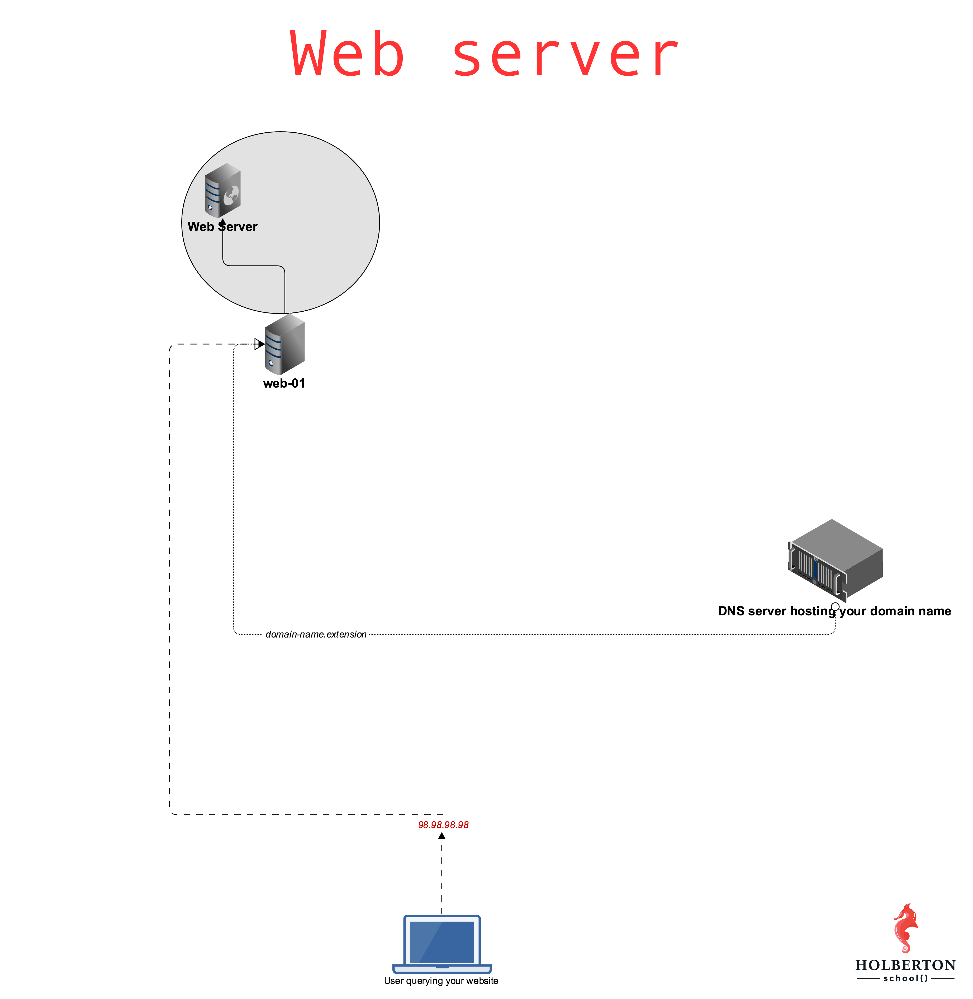

<h1>0x0C-web_server</h1>

 

In this project, some of the tasks will be graded on 2 aspects:
<ol>
<li>Is your web-01 server configured according to requirements</li>
<li>Does your answer file contain a Bash script that automatically performs commands to configure an Ubuntu machine to fit requirements (meaning without any human intervention)</li>
</ol>

For example, if I need to create a file /tmp/test containing the string hello world and modify the configuration of Nginx to listen on port 8080 instead of 80, I can use emacs on my server to create the file and to modify the Nginx configuration file /etc/nginx/sites-enabled/default.

 

But my answer file would contain:
 
<pre>
sylvain@ubuntu cat 88-script_example
#!/usr/bin/env bash
# Configuring a server with specification XYZ
echo hello world > /tmp/test
sed -i 's/80/8080/g' /etc/nginx/sites-enabled/default
sylvain@ubuntu
</pre>

As you can tell, I am not using emacs to perform the task in my answer file. This exercise is aiming at training you on automating your work. If you can automate tasks that you do manually, you can then automate yourself out of repetitive tasks and focus your energy on something more interesting. For an SRE, that comes very handy when there are hundreds or thousands of servers to manage, the work cannot be only done manually. Note that the checker will execute your script as the root user, you do not need to use the sudo command.

 

A good Software Engineer is a lazy Software Engineer. 

<h1>Resources</h1>
Read or watch:

<li><a href="https://intranet.alxswe.com/rltoken/6TI3HiyFdwrbXWKVF24Gxw">How the web works</a></li>
<li><a href="https://intranet.alxswe.com/rltoken/vkVMGlaf39j2DWAQWzo6EA">Nginx</a></li>
<li><a href="https://intranet.alxswe.com/rltoken/zKrpVxWuUHVdW4URAjdFbw">How to Configure Nginx</a></li>
<li><a href="https://intranet.alxswe.com/rltoken/Ar18u5sRis1fkvkVgzdcqg">Child process concept page</a></li>
<li><a href="https://intranet.alxswe.com/rltoken/xi3peVqYl02PfpHHHlCtxQ">Root and sub domain</a></li>
<li><a href="https://intranet.alxswe.com/rltoken/sBrrP4EAmI3NoYjIgZrUhw">HTTP requests</a></li>
<li><a href="https://intranet.alxswe.com/rltoken/Eaa4ZuKvye941hTkP8VlBQ">HTTP redirection</a></li>
<li><a href="https://intranet.alxswe.com/rltoken/eJSp2QFTY6jqqNtz8OVDEw">Not found HTTP response code</a></li>
<li><a href="https://intranet.alxswe.com/rltoken/7WMNY5CWD-CBrxmQrdmfPg">Logs files on Linux</a></li>
 
References:
<li><a href="https://intranet.alxswe.com/rltoken/BGa6RrS0dnM6EdBGS_ZDUw">RFC 7231 (HTTP/1.1)</a></li>
<li><a href="https://intranet.alxswe.com/rltoken/IZ2fyYn1qNZ9RXXsg5vG1g">RFC 7540 (HTTP/2)</a></li>
 
man or help:

scp
curl
Learning Objectives
At the end of this project, you are expected to be able to explain to anyone, without the help of Google:

<h3>General requirements</h3>
<li>Allowed editors: vi, vim, emacs</li>
<li>All your files will be interpreted on Ubuntu 16.04 LTS</li>
<li>All your files should end with a new line</li>
<li>A README.md file, at the root of the folder of the project, is mandatory</li>
<li>All your Bash script files must be executable</li>
<li>Your Bash script must pass Shellcheck (version 0.3.7) without any error</li>
<li>The first line of all your Bash scripts should be exactly #!/usr/bin/env bash</li>
<li>The second line of all your Bash scripts should be a comment explaining what is the script doing</li>
<li>You can’t use systemctl for restarting a process</li>
 
<h1>Tasks</h1>
<h3>0. Transfer a file to your server</h3>
mandatory

Write a Bash script that transfers a file from our client to a server:

Requirements:

<li>Accepts 4 parameters</li>
</li>The path to the file to be transferred</li>
</li>The IP of the server we want to transfer the file to</li>
</li>The username scp connects with</li>
</li>The path to the SSH private key that scp uses</li>
</li>Display Usage: 0-transfer_file PATH_TO_FILE IP USERNAME PATH_TO_SSH_KEY if less than 3 parameters passed</li>
</li>scp must transfer the file to the user home directory ~/</li>
</li>Strict host key checking must be disabled when using scp</li>
Example:
<pre>
sylvain@ubuntu$ ./0-transfer_file
Usage: 0-transfer_file PATH_TO_FILE IP USERNAME PATH_TO_SSH_KEY
sylvain@ubuntu$
sylvain@ubuntu$ ssh ubuntu@8.8.8.8 -i /vagrant/sylvain 'ls ~/'
afile
sylvain@ubuntu$ 
sylvain@ubuntu$ touch some_page.html
sylvain@ubuntu$ ./0-transfer_file some_page.html 8.8.8.8 sylvain /vagrant/private_key
some_page.html                                     100%   12     0.1KB/s   00:00
sylvain@ubuntu$ ssh ubuntu@8.8.8.8 -i /vagrant/private_key 'ls ~/'
afile
some_page.html
sylvain@ubuntu$

</pre>
 
In this example, I:

<li>remotely execute the ls ~/ command via ssh to see what ~/ contains</li>
<li>create a file named some_page.html</li>
<li>execute my 0-transfer_file script</li>
<li>remotely execute the ls ~/ command via ssh to see that the file some_page.html has been successfully transferred</li>
<li>That is one way of publishing your website pages to your server.</li>

<em>Repo:</em>

<li>GitHub repository: alx-system_engineering-devops</li>
<li>Directory: 0x0C-web_server</li>
<li>File: 0-transfer_file</li>
  
<h3>1. Install nginx web server</h3>

 
mandatory

Readme:

<li><a href="https://intranet.alxswe.com/rltoken/KJiFZ4yJyTGp_cv3DYQLaQ">-y on apt-get command</a></li>

Web servers are the piece of software generating and serving HTML pages, let’s install one!

Requirements:

<li>Install nginx on your web-01 server</li>
<li>Nginx should be listening on port 80</li>
<li>When querying Nginx at its root / with a GET request (requesting a page) using curl, it must return a page that contains the string Hello World!</li>
<li>As an answer file, write a Bash script that configures a new Ubuntu machine to respect above requirements (this script will be run on the server itself)</li>
<li>You can’t use systemctl for restarting nginx</li>
 
Server terminal:
<pre>
root@sy-web-01$ ./1-install_nginx_web_server > /dev/null 2>&1
root@sy-web-01$ 
root@sy-web-01$ curl localhost
Hello World!
root@sy-web-01$ 
</pre>
 
Local terminal:
 
<pre>
sylvain@ubuntu$ curl 34.198.248.145/
Hello World!
sylvain@ubuntu$ curl -sI 34.198.248.145/
HTTP/1.1 200 OK
Server: nginx/1.4.6 (Ubuntu)
Date: Tue, 21 Feb 2017 23:43:22 GMT
Content-Type: text/html
Content-Length: 30
Last-Modified: Tue, 21 Feb 2017 07:21:32 GMT
Connection: keep-alive
ETag: "58abea7c-1e"
Accept-Ranges: bytes

sylvain@ubuntu$
</pre>
In this example 34.198.248.145 is the IP of my web-01 server. If you want to query the Nginx that is locally installed on your server, you can use curl 127.0.0.1.

If things are not going as expected, make sure to check out Nginx logs, they can be found in /var/log/.

 
<em>Repo:</em>

<li>GitHub repository: alx-system_engineering-devops</li>
<li>Directory: 0x0C-web_server</li>
<li>File: 1-install_nginx_web_server</li>
 
<h3>2. Setup a domain name</h3>
mandatory

<a href="https://intranet.alxswe.com/rltoken/Hcb-pfK8UiDBfwsDJPyZZw">.TECH Domains</a> is one of the top domain providers. They are known for the stability and quality of their DNS hosting solution. We partnered with .TECH Domains so that you can learn about DNS.

.TECH Domains worked with domain name registrars to give you access to a free domain name for a year. Please get the promo code in your tools space. Feel free to drop a thank you tweet for .TECH Domains.

Provide the domain name in your answer file.

Requirement:

provide the domain name only (example: foobar.tech), no subdomain (example: www.foobar.tech)
configure your DNS records with an A entry so that your root domain points to your web-01 IP address Warning: the propagation of your records can take time (~1-2 hours)
go to your profile and enter your domain in the Project website url field

 
Example:
 
<pre>
sylvain@ubuntu$ cat 2-setup_a_domain_name
myschool.tech
sylvain@ubuntu$
sylvain@ubuntu$ dig myschool.tech

; <<>> DiG 9.10.6 <<>> myschool.tech
;; global options: +cmd
;; Got answer:
;; ->>HEADER<<- opcode: QUERY, status: NOERROR, id: 26785
;; flags: qr rd ra; QUERY: 1, ANSWER: 1, AUTHORITY: 0, ADDITIONAL: 1

;; OPT PSEUDOSECTION:
; EDNS: version: 0, flags:; udp: 512
;; QUESTION SECTION:
;myschool.tech.     IN  A

;; ANSWER SECTION:
myschool.tech.  7199    IN  A   184.72.193.201

;; Query time: 65 msec
;; SERVER: 8.8.8.8#53(8.8.8.8)
;; WHEN: Fri Aug 02 09:44:36 PDT 2019
;; MSG SIZE  rcvd: 65

sylvain@ubuntu$

</pre>
 

When your domain name is setup, please verify the Registrar here: https://whois.whoisxmlapi.com/ and you must see in the JSON response: "registrarName": "Dotserve Inc"

<em>Repo:</em>

<li>GitHub repository: alx-system_engineering-devops</li>
<li>Directory: 0x0C-web_server</li>
<li>File: 2-setup_a_domain_name</li>
 
<h3>3. Redirection</h3>
mandatory
Readme:

<li><a href="https://intranet.alxswe.com/rltoken/RRP9hX3MlQdABaKZD-Y_cA">Replace a line with multiple lines with sed</a></li>
 
Configure your Nginx server so that /redirect_me is redirecting to another page.
 
Requirements:

<li>The redirection must be a “301 Moved Permanently”</li>
<li>You answer file should be a Bash script containing commands to automatically configure a Ubuntu machine to respect above requirements</li>
<li>Using what you did with 1-install_nginx_web_server, write 3-redirection so that it configures a brand new Ubuntu machine to the requirements asked in this task</li>
 
Example:
 

<pre>
sylvain@ubuntu$ curl -sI 34.198.248.145/redirect_me/
HTTP/1.1 301 Moved Permanently
Server: nginx/1.4.6 (Ubuntu)
Date: Tue, 21 Feb 2017 21:36:04 GMT
Content-Type: text/html
Content-Length: 193
Connection: keep-alive
Location: https://www.youtube.com/watch?v=QH2-TGUlwu4

sylvain@ubuntu$
</pre>
<em>Repo:<.em>

<li>GitHub repository: alx-system_engineering-devops</li>
<li>Directory: 0x0C-web_server</li>
<li>File: 3-redirection</li>
  
<h3>4. Not found page 404</h3>
mandatory
Configure your Nginx server to have a custom 404 page that contains the string Ceci n'est pas une page.

Requirements:

<li>The page must return an HTTP 404 error code</li>
<li>The page must contain the string Ceci n'est pas une page</li>
<li>Using what you did with 3-redirection, write 4-not_found_page_404 so that it configures a brand new Ubuntu machine to the requirements asked in this task</li>
 
Example:
 
<pre>
sylvain@ubuntu$ curl -sI 34.198.248.145/xyz
HTTP/1.1 404 Not Found
Server: nginx/1.4.6 (Ubuntu)
Date: Tue, 21 Feb 2017 21:46:43 GMT
Content-Type: text/html
Content-Length: 26
Connection: keep-alive
ETag: "58acb50e-1a"

sylvain@ubuntu$ curl 34.198.248.145/xyzfoo
Ceci n'est pas une page

sylvain@ubuntu$
</pre>
<em>Repo:</em>

<li>GitHub repository: alx-system_engineering-devops</li>
<li>Directory: 0x0C-web_server</li>
<li>File: 4-not_found_page_404</li>
  
<h3>5. Install Nginx web server (w/ Puppet)</h3>
#advanced
Time to practice configuring your server with Puppet! Just as you did before, we’d like you to install and configure an Nginx server using Puppet instead of Bash. To save time and effort, you should also include resources in your manifest to perform a 301 redirect when querying /redirect_me.
 
Requirements:
 
<li>Nginx should be listening on port 80
<li>When querying Nginx at its root / with a GET request (requesting a page) using curl, it must return a page that contains the string Hello World!
<li>The redirection must be a “301 Moved Permanently”
<li>Your answer file should be a Puppet manifest containing commands to automatically configure an Ubuntu machine to respect above requirements
<em>Repo:</em>

<li>GitHub repository: alx-system_engineering-devops</li>
<li>Directory: 0x0C-web_server</li>
<li>File: 7-puppet_install_nginx_web_server.pp</li>
 
