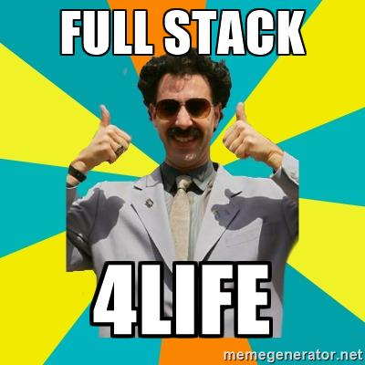

<h1>0x11-what_happens_when_your_type_google_com_in_your_browser_and_press_enter</h1>

<h1>Background Context</h1>

Being a Full-Stack Software Engineer means you’re comfortable interacting with any layer of the stack.

A way to easily assess this is to simply ask an engineer to explain how a software system works. They can have a general overview of the flow or can choose to dig deep in a certain area.

Let’s practice by exploring the infrastructure side (network, servers, security…) of the question.

 

 
<h1>Requirements</h1>
<h2>General</h2>
<li>You can post your blog post on the platform of your choice, LinkedIn or Medium are good ones</li>
<li>A README.md file, at the root of the folder of the project, is mandatory</li>

<h1>Tasks</h1>
<h3>0. What happens when...</h3>
<em>mandatory</em>

This question is a classic and still widely used interview question for many types of software engineering position. It is used to assess a candidate’s general knowledge of how the web stack works on top of the internet. One important guideline to begin answering this question is that you should ask your interviewer whether they would like you to focus in on one specific area of the workflow. For a front-end position they may want you to talk at length about how the DOM is rendering. For an SRE position they may want you to go into the load balancing mechanism.

 

This question is a good test of whether you understand DNS. Many software engineering candidates struggle with this concept, so if you do well on this question, you are already way ahead of the curve. If you take this project seriously and write an excellent article, it may be something that will grab the attention of future employers.

 

Write a blog post explaining what happens when you type https://www.google.com in your browser and press Enter.

 
<em>Requirements, your post must cover:</em>

<li>DNS request</li>
<li>TCP/IP</li>
<li>Firewall</li>
<li>HTTPS/SSL</li>
<li>Load-balancer</li>
<li>Web server</li>
<li>Application server</li>
<li>Database</li>
 

Publish your blog post on Medium or LinkedIn; share the URL of your blog post in your answer file and in the field below.

Please, remember that these blogs must be written in English to further your technical ability in a variety of settings.

Add URLs 
<em>Repo:</em>

<li>GitHub repository: alx-system_engineering-devops</li>
<li>Directory: 0x11-what_happens_when_your_type_google_com_in_your_browser_and_press_enter</li>
<li>File: 0-blog_post</li>
 
<h3>1. Everything's better with a pretty diagram</h3>
<em>#advanced</em>

Add a schema to your blog post illustrating the flow of the request created when you type https://www.google.com in your browser and press Enter.

 
The diagram should show:

<li>DNS resolution</li>
<li>that the request hitting server IP on the appropriate port</li>
<li>that the traffic is encrypted</li>
<li>that the traffic goes through a firewall</li>
<li>that the request is distributed via a load balancer</li>
<li>that the web server answers the request by serving a web page</li>
<li>that the application server generates the web page</li>
<li>that the application server request data from the database</li>
<a href="https://intranet.alxswe.com/rltoken/0KvO5Zd6t2GfDUiUHvNJjQ">Gliffy</a>is free and can be used to design professional looking diagrams.</li>

Some unrelated examples:

 

Share the URL of your diagram image in your answer file and il the field below.

Please, remember that these blogs must be written in English to further your technical ability in a variety of settings.

<em>Repo:</em>

<li>GitHub repository: alx-system_engineering-devops</li>
<li>Directory: 0x11-what_happens_when_your_type_google_com_in_your_browser_and_press_enter</li>
<li>File: 1-what_happen_when_diagram</li>
 
<h3>2. Contribute!</h3>
<em>#advanced</em>

Folks on the Internet have been trying to put together a comprehensive answer to the question. Help them by submitting a pull request. Paste the link in your answer file.

https://github.com/alex/what-happens-when#the-g-key-is-pressed

Requirements:

<li>The pull request must bring meaningful value (not a typo correction or style improvement)</li>
<li>Share the pull request URL in your answer file and in the field below</li>
<li>Please, remember that these blogs must be written in English to further your technical ability in a variety of settings.</li>

<em>Repo:</em>

<li>GitHub repository: alx-system_engineering-devops</li>
<li>Directory: 0x11-what_happens_when_your_type_google_com_in_your_browser_and_press_enter</li>
<li>File: 2-contribution-to_what-happens-when_github_answer</li>

